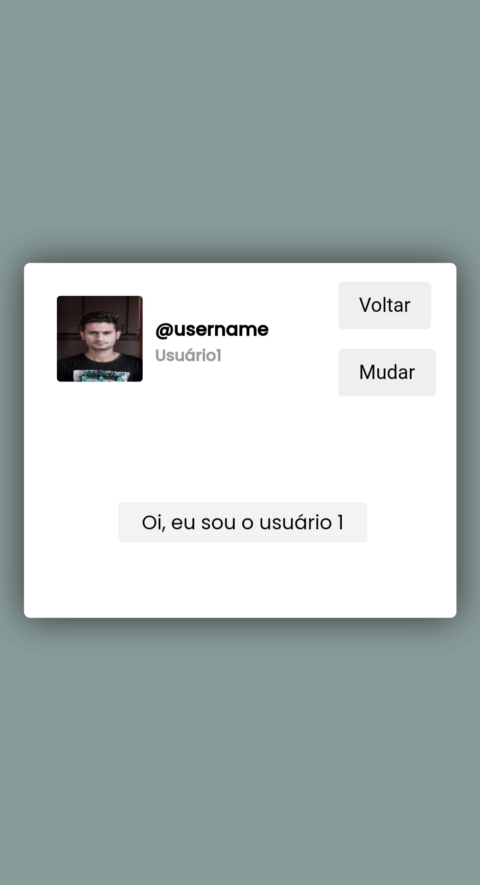

<h1 align="center">Caixa de comentário</h1>
<p align="center">Fiz uma caixa de comentário onde pode mudar para ver a mensagem de dois users.</p> 

# 👨🏻‍💻 O que usei
  
=
# 💻 Tela do projeto
<p align="center">

</p>

<p align="center">
   Link do projeto: https://matheusnsilvab.github.io/Caixa-de-comentario/
</p>

# 🚀 Comandos de instalação
```
git clone https://github.com/matheusnsilvab/Caixa-de-comentario.git
cd Caixa-de-comentario
```
